# Chapter 1: Prompt Chaining

## At a Glance

**What:** Complex tasks often overwhelm LLMs when handled within a single prompt, leading to significant performance issues. The cognitive load on the model increases the likelihood of errors such as overlooking instructions, losing context, and generating incorrect information. A monolithic prompt struggles to manage multiple constraints and sequential reasoning steps effectively. This results in unreliable and inaccurate outputs, as the LLM fails to address all facets of the multifaceted request.

**是什么：** 复杂任务在单个提示词内处理时通常会使 LLM 不堪重负，导致严重的性能问题。模型的认知负荷增加了错误的可能性，如忽略指令、失去上下文和生成错误信息。单体提示词难以有效管理多个约束和顺序推理步骤。这导致不可靠和不准确的输出，因为 LLM 未能解决多方面请求的所有方面。

**Why:** Prompt chaining provides a standardized solution by breaking down a complex problem into a sequence of smaller, interconnected sub-tasks. Each step in the chain uses a focused prompt to perform a specific operation, significantly improving reliability and control. The output from one prompt is passed as the input to the next, creating a logical workflow that progressively builds towards the final solution. This modular, divide-and-conquer strategy makes the process more manageable, easier to debug, and allows for the integration of external tools or structured data formats between steps. This pattern is foundational for developing sophisticated, multi-step Agentic systems that can plan, reason, and execute complex workflows.

**为什么：** 提示词链通过将复杂问题分解为一系列较小的、相互关联的子任务来提供标准化解决方案。链中的每一步使用聚焦的提示词执行特定操作，显著提高可靠性和控制力。一个提示词的输出作为下一个提示词的输入传递，创建逐步构建最终解决方案的逻辑工作流。这种模块化的分而治之策略使过程更易于管理、更易于调试，并允许在步骤之间集成外部工具或结构化数据格式。这种模式是开发能够规划、推理和执行复杂工作流的复杂多步智能体系统的基础。

**Rule of thumb:** Use this pattern when a task is too complex for a single prompt, involves multiple distinct processing stages, requires interaction with external tools between steps, or when building Agentic systems that need to perform multi-step reasoning and maintain state.

**经验法则：** 当任务对于单个提示词过于复杂、涉及多个不同的处理阶段、需要在步骤之间与外部工具交互，或者在构建需要执行多步推理并维护状态的智能体系统时，使用此模式。

Visual Summary

Fig. 1-1: Prompt Chaining Pattern: Agents receive a series of prompts from the user, with the output of each agent serving as the input for the next in the chain.

## Key Takesaways

- Prompt Chaining breaks down complex tasks into a sequence of smaller, focused steps. This is occasionally known as the Pipeline pattern.
- Each step in a chain involves an LLM call or processing logic, using the output of the previous step as input.
- This pattern improves the reliability and manageability of complex interactions with language models.
- Frameworks like LangChain/LangGraph, and Google ADK provide robust tools to define, manage, and execute these multi-step sequences.
- 提示词链将复杂任务分解为一系列较小的、聚焦的步骤。这有时也被称为管道模式。
- 链中的每一步都涉及LLM调用或处理逻辑，使用前一步的输出作为输入。
- 这种模式提高了与语言模型进行复杂交互的可靠性和可管理性。
- LangChain/LangGraph和Google ADK等框架提供了定义、管理和执行这些多步序列的健壮工具。

## Conclusion

By deconstructing complex problems into a sequence of simpler, more manageable sub-tasks, prompt chaining provides a robust framework for guiding large language models. This “divide-and-conquer” strategy significantly enhances the reliability and control of the output by focusing the model on one specific operation at a time. As a foundational pattern, it enables the development of sophisticated AI agents capable of multi-step reasoning, tool integration, and state management. Ultimately, mastering prompt chaining is crucial for building robust, context-aware systems that can execute intricate workflows well beyond the capabilities of a single prompt.

通过将复杂问题分解为一系列更简单、更易于管理的子任务，提示词链为指导大型语言模型提供了一个健壮的框架。这种”分而治之”策略通过一次专注于一个特定操作，显著提高了输出的可靠性和控制力。作为基础模式，它支持开发能够进行多步推理、工具集成和状态管理的复杂 AI 智能体系统。最终，掌握提示词链对于构建能够执行远超单个提示词能力的复杂工作流的健壮、上下文感知系统至关重要。

# Chapter 2: Routing

## At a Glance

**What**: Agentic systems must often respond to a wide variety of inputs and situations that cannot be handled by a single, linear process. A simple sequential workflow lacks the ability to make decisions based on context. Without a mechanism to choose the correct tool or sub-process for a specific task, the system remains rigid and non-adaptive. This limitation makes it difficult to build sophisticated applications that can manage the complexity and variability of real-world user requests.

**是什么：** 智能体系统必须经常响应各种各样的输入和情况，这些无法由单一的线性流程处理。简单的顺序工作流缺乏基于上下文做出决策的能力。没有为特定任务选择正确工具或子流程的机制，系统仍然是僵化和非自适应的。这种限制使得难以构建能够管理现实世界用户请求的复杂性和可变性的复杂应用程序。

**Why:** The Routing pattern provides a standardized solution by introducing conditional logic into an agent’s operational framework. It enables the system to first analyze an incoming query to determine its intent or nature. Based on this analysis, the agent dynamically directs the flow of control to the most appropriate specialized tool, function, or sub-agent. This decision can be driven by various methods, including prompting LLMs, applying predefined rules, or using embedding-based semantic similarity. Ultimately, routing transforms a static, predetermined execution path into a flexible and context-aware workflow capable of selecting the best possible action.

**为什么：** 路由模式通过将条件逻辑引入智能体的操作框架提供了标准化解决方案。它使系统能够首先分析传入查询以确定其意图或性质。基于此分析，智能体动态地将控制流定向到最合适的专门工具、函数或子智能体。这个决策可以由各种方法驱动，包括提示 LLM、应用预定义规则或使用基于嵌入的语义相似性。最终，路由将静态的预定执行路径转变为能够选择最佳可能操作的灵活和上下文感知工作流。

**Rule of Thumb:** Use the Routing pattern when an agent must decide between multiple distinct workflows, tools, or sub-agents based on the user’s input or the current state. It is essential for applications that need to triage or classify incoming requests to handle different types of tasks, such as a customer support bot distinguishing between sales inquiries, technical support, and account management questions.

**经验法则：** 当智能体必须根据用户输入或当前状态在多个不同的工作流、工具或子智能体之间做出决策时，使用路由模式。它对于需要对传入请求进行分类以处理不同类型任务的应用程序至关重要，例如客户支持机器人区分销售查询、技术支持和帐户管理问题。

## **Visual Summary**

​                                          Fig.2-1: Router pattern, using an LLM as a Router

## Key Takeaways

- Routing enables agents to make dynamic decisions about the next step in a workflow based on conditions.
- It allows agents to handle diverse inputs and adapt their behavior, moving beyond linear execution.
- Routing logic can be implemented using LLMs, rule-based systems, or embedding similarity.
- Frameworks like LangGraph and Google ADK provide structured ways to define and manage routing within agent workflows, albeit with different architectural approaches.
- 路由使智能体能够根据条件动态决定工作流中的下一步。
- 它允许智能体处理各种输入并调整其行为，超越线性执行。
- 路由逻辑可以使用 LLM、基于规则的系统或嵌入相似性实现。
- 像 LangGraph 和 Google ADK 这样的框架提供了在智能体工作流中定义和管理路由的结构化方式，尽管采用不同的架构方法。

## Conclusion

The Routing pattern is a critical step in building truly dynamic and responsive agentic systems. By implementing routing, we move beyond simple, linear execution flows and empower our agents to make intelligent decisions about how to process information, respond to user input, and utilize available tools or sub-agents.

路由模式是构建真正动态响应式智能体系统的关键步骤。通过实现路由，我们超越了简单的线性执行流，使智能体能够智能地决策如何处理信息、响应用户输入以及利用可用工具或子智能体。

We’ve seen how routing can be applied in various domains, from customer service chatbots to complex data processing pipelines. The ability to analyze input and conditionally direct the workflow is fundamental to creating agents that can handle the inherent variability of real-world tasks.

我们已经看到路由如何应用于各个领域，从客户服务聊天机器人到复杂的数据处理管道。分析输入并有条件地指导工作流的能力是创建能够处理现实世界任务固有可变性的智能体的基础。

The code examples using LangChain and Google ADK demonstrate two different, yet effective, approaches to implementing routing. LangGraph’s graph-based structure provides a visual and explicit way to define states and transitions, making it ideal for complex, multi-step workflows with intricate routing logic. Google ADK, on the other hand, often focuses on defining distinct capabilities (Tools) and relies on the framework’s ability to route user requests to the appropriate tool handler, which can be simpler for agents with a well-defined set of discrete actions.

使用 LangChain 和 Google ADK 的代码示例展示了实现路由的两种不同但有效的方法。LangGraph 基于图的结构提供了定义状态和转换的可视化和显式方式，使其成为具有复杂路由逻辑的复杂多步工作流的理想选择。另一方面，Google ADK 通常专注于定义不同的能力（工具）并依赖框架将用户请求路由到适当的工具处理程序的能力，这对于具有明确定义的离散操作集的智能体来说可能更简单。

Mastering the Routing pattern is essential for building agents that can intelligently navigate different scenarios and provide tailored responses or actions based on context. It’s a key component in creating versatile and robust agentic applications.

掌握路由模式对于构建能够智能地导航不同场景并根据上下文提供定制响应或操作的智能体至关重要。它是创建多功能和健壮智能体应用程序的关键组件。

# Chapter 3: Parallelization

## At a Glance

**What:** Many agentic workflows involve multiple sub-tasks that must be completed to achieve a final goal. A purely sequential execution, where each task waits for the previous one to finish, is often inefficient and slow. This latency becomes a significant bottleneck when tasks depend on external I/O operations, such as calling different APIs or querying multiple databases. Without a mechanism for concurrent execution, the total processing time is the sum of all individual task durations, hindering the system’s overall performance and responsiveness.

**是什么：** 许多智能体工作流包含多个必须完成才能达成最终目标的子任务。纯顺序执行（每个任务等待前一个完成）通常低效且缓慢。当任务依赖外部 I/O 操作（如调用不同 API 或查询多个数据库）时，这种延迟成为主要瓶颈。若无并发执行机制，总处理时间等于所有单个任务持续时间之和，严重制约系统整体性能和响应能力。

**Why:** The Parallelization pattern provides a standardized solution by enabling the simultaneous execution of independent tasks. It works by identifying components of a workflow, like tool usages or LLM calls, that do not rely on each other’s immediate outputs. Agentic frameworks like LangChain and the Google ADK provide built-in constructs to define and manage these concurrent operations. For instance, a main process can invoke several sub-tasks that run in parallel and wait for all of them to complete before proceeding to the next step. By running these independent tasks at the same time rather than one after another, this pattern drastically reduces the total execution time.

**为什么：** 并行化模式通过启用独立任务的同时执行提供标准化解决方案。该模式通过识别工作流中不依赖彼此即时输出的组件（如工具使用或 LLM 调用）来实现。像 LangChain 和 Google ADK 这样的智能体框架提供内置构造来定义和管理这些并发操作。例如，主进程可调用多个并行运行的子任务，等待所有子任务完成后再继续下一步。通过同时而非顺序执行这些独立任务，该模式显著减少总执行时间。

**Rule of thumb:** Use this pattern when a workflow contains multiple independent operations that can run simultaneously, such as fetching data from several APIs, processing different chunks of data, or generating multiple pieces of content for later synthesis.

**经验法则：** 当工作流包含多个可同时运行的独立操作时使用此模式，例如从多个 API 获取数据、处理不同数据块或生成多个内容片段供后续综合。

## Visual Summary

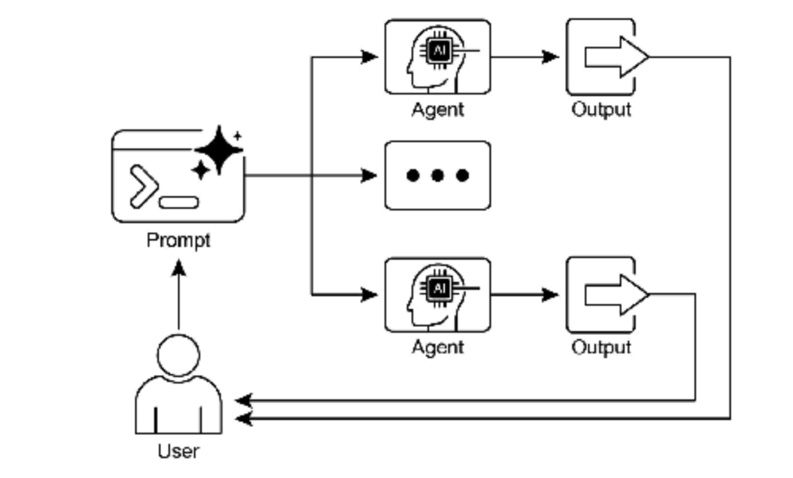

## Key Takeaways 

- Parallelization is a pattern for executing independent tasks concurrently to improve efficiency.
- 并行化是一种通过并发执行独立任务来提高效率的模式
- It is particularly useful when tasks involve waiting for external resources, such as API calls.
- 在涉及等待外部资源（如 API 调用）的任务中特别有效
- The adoption of a concurrent or parallel architecture introduces substantial complexity and cost, impacting key development phases such as design, debugging, and system logging.
- 采用并发或并行架构会引入显著复杂性和成本，影响设计、调试和系统日志等关键开发环节
- Frameworks like LangChain and Google ADK provide built-in support for defining and managing parallel execution.
- 像 LangChain 和 Google ADK 这样的框架提供定义和管理并行执行的内置支持
- In LangChain Expression Language (LCEL), RunnableParallel is a key construct for running multiple runnables side-by-side.
- 在 LangChain 表达式语言（LCEL）中，RunnableParallel 是并行运行多个可运行对象的关键构造
- Google ADK can facilitate parallel execution through LLM-Driven Delegation, where a Coordinator agent’s LLM identifies independent sub-tasks and triggers their concurrent handling by specialized sub-agents.
- Google ADK 可通过 LLM 驱动的委托实现并行执行，协调器智能体的 LLM 识别独立子任务并触发专门子智能体的并发处理
- Parallelization helps reduce overall latency and makes agentic systems more responsive for complex tasks.
- 并行化有助于减少整体延迟，使智能体系统在处理复杂任务时更具响应性

## conclusion 

The parallelization pattern is a method for optimizing computational workflows by concurrently executing independent sub-tasks. This approach reduces overall latency, particularly in complex operations that involve multiple model inferences or calls to external services.

并行化模式是通过并发执行独立子任务来优化计算工作流的方法。该模式有效减少整体延迟，在涉及多个模型推理或对外部服务调用的复杂操作中尤为显著。

Frameworks provide distinct mechanisms for implementing this pattern. In LangChain, constructs like RunnableParallel are used to explicitly define and execute multiple processing chains simultaneously. In contrast, frameworks like the Google Agent Developer Kit (ADK) can achieve parallelization through multi-agent delegation, where a primary coordinator model assigns different sub-tasks to specialized agents that can operate concurrently.

不同框架为此模式提供了不同的实现机制。在 LangChain 中，通过 RunnableParallel 等构造显式定义并同时执行多个处理链。而 Google 智能体开发工具包 (ADK) 等框架则通过多智能体委托实现并行化，由主协调器模型将不同子任务分配给可并发操作的专门智能体。

By integrating parallel processing with sequential (chaining) and conditional (routing) control flows, it becomes possible to construct sophisticated, high-performance computational systems capable of efficiently managing diverse and complex tasks.

通过将并行处理与顺序（链式）和条件（路由）控制流相结合，可以构建能够高效管理各类复杂任务的复杂、高性能计算系统。

# Chapter 4: Reflection

## At a Glance

**What:** An agent’s initial output is often suboptimal, suffering from inaccuracies, incompleteness, or a failure to meet complex requirements. Basic agentic workflows lack a built-in process for the agent to recognize and fix its own errors. This is solved by having the agent evaluate its own work or, more robustly, by introducing a separate logical agent to act as a critic, preventing the initial response from being the final one regardless of quality.

**是什么：** 智能体的初始输出往往次优，存在不准确、不完整或未能满足复杂要求的问题。基础智能体工作流缺乏让智能体识别和修复自身错误的内置流程。这通过让智能体评估自身工作，或更稳健地引入独立逻辑智能体充当评审者来解决，防止无论质量如何初始响应都成为最终结果。

**Why:** The Reflection pattern offers a solution by introducing a mechanism for self-correction and refinement. It establishes a feedback loop where a “producer” agent generates an output, and then a “critic” agent (or the producer itself) evaluates it against predefined criteria. This critique is then used to generate an improved version. This iterative process of generation, evaluation, and refinement progressively enhances the quality of the final result, leading to more accurate, coherent, and reliable outcomes.

**为什么：** 反思模式通过引入自我纠正和优化机制提供了解决方案。它建立反馈循环，其中”生产者”智能体生成输出，然后”评审者”智能体（或生产者自身）根据预定义标准进行评估。随后使用此评审生成改进版本。这种生成、评估和优化的迭代过程逐步提升最终结果的质量，从而产生更准确、连贯和可靠的结果。

**Rule of thumb:** Use the Reflection pattern when the quality, accuracy, and detail of the final output are more important than speed and cost. It is particularly effective for tasks like generating polished long-form content, writing and debugging code, and creating detailed plans. Employ a separate critic agent when tasks require high objectivity or specialized evaluation that a generalist producer agent might miss.

**经验法则：** 当最终输出的质量、准确性和细节比速度和成本更重要时使用反思模式。它对生成精炼的长篇内容、编写和调试代码以及创建详细计划等任务特别有效。当任务需要通用生产者智能体可能遗漏的高客观性或专门评估时，使用独立评审者智能体。

## visual Summary

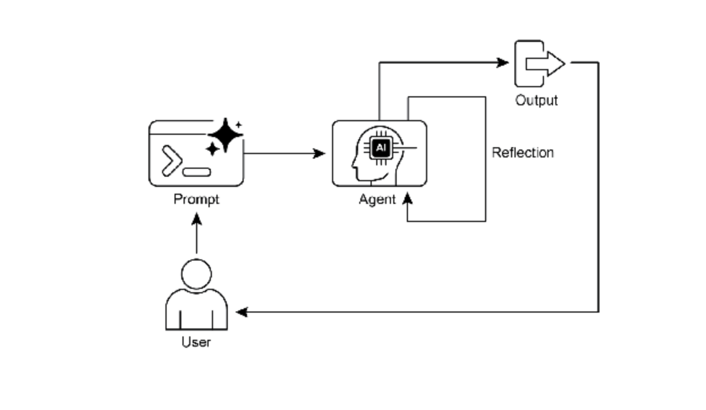

​                                               Fig. 4-1: Reflection design pattern, self-reflection

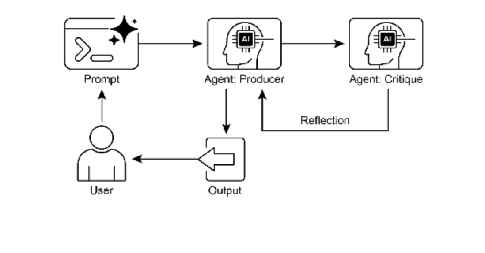

​                                     Fig.4-2: Reflection design pattern, producer and critique agent

## Key Takeaways 

- The primary advantage of the Reflection pattern is its ability to iteratively self-correct and refine outputs, leading to significantly higher quality, accuracy, and adherence to complex instructions.
- It involves a feedback loop of execution, evaluation/critique, and refinement. Reflection is essential for tasks requiring high-quality, accurate, or nuanced outputs.
- A powerful implementation is the Producer-Critic model, where a separate agent (or prompted role) evaluates the initial output. This separation of concerns enhances objectivity and allows for more specialized, structured feedback.
- However, these benefits come at the cost of increased latency and computational expense, along with a higher risk of exceeding the model’s context window or being throttled by API services.
- While full iterative reflection often requires stateful workflows (like LangGraph), a single reflection step can be implemented in LangChain using LCEL to pass output for critique and subsequent refinement.
- Google ADK can facilitate reflection through sequential workflows where one agent’s output is critiqued by another agent, allowing for subsequent refinement steps.
- This pattern enables agents to perform self-correction and enhance their performance over time.
- 反思模式的主要优势在于其能够迭代地自我纠正和优化输出，从而显著提高质量、准确性和对复杂指令的遵循度。
- 它涉及执行、评估/评审和优化的反馈循环。反思对需要高质量、准确或精细输出的任务至关重要。
- 一个强大的实现是生产者-评审者模型，其中独立智能体（或提示角色）评估初始输出。这种关注点分离增强了客观性，并支持更专业、结构化的反馈。
- 然而，这些优势是以增加的延迟和计算成本为代价的，同时伴随超出模型上下文窗口或被API服务限制的更高风险。
- 虽然完整的迭代反思通常需要有状态的工作流（如LangGraph），但单个反思步骤可在LangChain中使用LCEL实现，以将输出传递给评审和后续优化。
- Google ADK 可通过顺序工作流促进反思，其中一个智能体的输出被另一个智能体评审，允许后续优化步骤。
- 此模式使智能体执行自我纠正并随时间提升性能。

## Conclusion

The reflection pattern provides a crucial mechanism for self-correction within an agent’s workflow, enabling iterative improvement beyond a single-pass execution. This is achieved by creating a loop where the system generates an output, evaluates it against specific criteria, and then uses that evaluation to produce a refined result. This evaluation can be performed by the agent itself (self-reflection) or, often more effectively, by a distinct critic agent, which represents a key architectural choice within the pattern.

反思模式为智能体工作流中的自我纠正提供了关键机制，实现了超越单次执行的迭代改进。这通过创建一个循环来实现：系统生成输出，根据特定标准评估它，然后使用该评估产生优化结果。这种评估可以由智能体自身执行（自我反思），或者通常更有效地由不同的评审者智能体执行，这代表了模式内的一个关键架构选择。

While a fully autonomous, multi-step reflection process requires a robust architecture for state management, its core principle is effectively demonstrated in a single generate-critique-refine cycle. As a control structure, reflection can be integrated with other foundational patterns to construct more robust and functionally complex agentic systems.

虽然完全自主的多步反思过程需要强大的状态管理架构，但其核心原理在单个生成-评审-优化周期中得到了有效展示。作为一种控制结构，反思可以与其他基础模式集成，以构建更健壮和功能更复杂的智能体系统。

# Chapter 5: Tool Use

## At a Glance

**What:** LLMs are powerful text generators, but they are fundamentally disconnected from the outside world. Their knowledge is static, limited to the data they were trained on, and they lack the ability to perform actions or retrieve real-time information. This inherent limitation prevents them from completing tasks that require interaction with external APIs, databases, or services. Without a bridge to these external systems, their utility for solving real-world problems is severely constrained.

**是什么：** 大型语言模型（LLM）是强大的文本生成器，但它们基本上与外部世界断开连接。它们的知识是静态的，仅限于训练数据，并且缺乏执行操作或检索实时信息的能力。这种固有的限制阻止它们完成需要与外部 API、数据库或服务交互的任务。没有通往这些外部系统的桥梁，它们解决现实世界问题的效用受到严重限制。

**Why:** The Tool Use pattern, often implemented via function calling, provides a standardized solution to this problem. It works by describing available external functions, or “tools,” to the LLM in a way it can understand. Based on a user’s request, the agentic LLM can then decide if a tool is needed and generate a structured data object (like a JSON) specifying which function to call and with what arguments. An orchestration layer executes this function call, retrieves the result, and feeds it back to the LLM. This allows the LLM to incorporate up-to-date, external information or the result of an action into its final response, effectively giving it the ability to act.

**为什么：** 工具使用模式（通常通过工具调用实现）为此问题提供了标准化解决方案。它的工作原理是以 LLM 可以理解的方式向其描述可用的外部函数或”工具”。基于用户的请求，智能体 LLM 可以决定是否需要工具，并生成指定要调用哪个函数以及使用什么参数的结构化数据对象（如 JSON）。编排层执行此工具调用，检索结果，并将其反馈给 LLM。这允许 LLM 将最新的外部信息或操作结果合并到其最终响应中，有效地赋予其行动能力。

**Rule of thumb:** Use the Tool Use pattern whenever an agent needs to break out of the LLM’s internal knowledge and interact with the outside world. This is essential for tasks requiring real-time data (e.g., checking weather, stock prices), accessing private or proprietary information (e.g., querying a company’s database), performing precise calculations, executing code, or triggering actions in other systems (e.g., sending an email, controlling smart devices).

**经验法则：** 当智能体需要突破 LLM 的内部知识并与外部世界交互时，使用工具使用模式。这对于需要实时数据（例如，检查天气、股票价格）、访问私有或专有信息（例如，查询公司数据库）、执行精确计算、执行代码或触发其他系统中的操作（例如，发送电子邮件、控制智能设备）的任务至关重要。

## Visual Summary

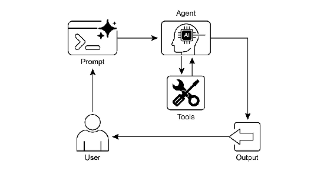

​                                                              Fig.5-1: Tool use design pattern

## Key Takeaways 

- Tool Use (Function Calling) allows agents to interact with external systems and access dynamic information.
- It involves defining tools with clear descriptions and parameters that the LLM can understand.
- The LLM decides when to use a tool and generates structured function calls.
- Agentic frameworks execute the actual tool calls and return the results to the LLM.
- Tool Use is essential for building agents that can perform real-world actions and provide up-to-date information.
- LangChain simplifies tool definition using the @tool decorator and provides create_tool_calling_agent and AgentExecutor for building tool-using agents.
- Google ADK has a number of very useful pre-built tools such as Google Search, Code Execution and Vertex AI Search Tool.
- 工具使用（函数调用）允许智能体与外部系统交互并访问动态信息。
- 它涉及定义具有 LLM 可以理解的清晰描述和参数的工具。
- LLM 决定何时使用工具并生成结构化工具调用。
- 智能体框架执行实际的工具调用并将结果返回给 LLM。
- 工具使用对于构建可以执行现实世界操作并提供最新信息的智能体至关重要。
- LangChain 使用 @tool 装饰器简化工具定义，并提供 create_tool_calling_agent 和 AgentExecutor 用于构建工具使用智能体。
- Google ADK 有许多非常有用的预构建工具，如 Google 搜索、代码执行和 Vertex AI 搜索工具。

## Conclusion

The Tool Use pattern is a critical architectural principle for extending the functional scope of large language models beyond their intrinsic text generation capabilities. By equipping a model with the ability to interface with external software and data sources, this paradigm allows an agent to perform actions, execute computations, and retrieve information from other systems. This process involves the model generating a structured request to call an external tool when it determines that doing so is necessary to fulfill a user’s query. Frameworks such as LangChain, Google ADK, and Crew AI offer structured abstractions and components that facilitate the integration of these external tools. These frameworks manage the process of exposing tool specifications to the model and parsing its subsequent tool-use requests. This simplifies the development of sophisticated agentic systems that can interact with and take action within external digital environments.

工具使用模式是将大型语言模型的功能范围扩展到其固有文本生成能力之外的关键架构原则。通过为模型配备与外部软件和数据源交互的能力，此范式允许智能体执行操作、进行计算并从其他系统检索信息。此过程涉及模型在确定满足用户查询需要时生成调用外部工具的结构化请求。LangChain、Google ADK 和 CrewAI 等框架提供结构化抽象和组件，促进这些外部工具的集成。这些框架管理向模型公开工具规范并解析其后续工具使用请求的过程。这简化了可以与外部数字环境交互并在其中采取行动的复杂智能体系统的开发。

# Chapter 6: Planning

## At a Glance

**What:** Complex problems often cannot be solved with a single action and require foresight to achieve a desired outcome. Without a structured approach, an agentic system struggles to handle multifaceted requests that involve multiple steps and dependencies. This makes it difficult to break down high-level objectives into a manageable series of smaller, executable tasks. Consequently, the system fails to strategize effectively, leading to incomplete or incorrect results when faced with intricate goals.

**是什么：** 复杂问题通常无法通过单一行动解决，需要远见卓识来实现预期结果。如果没有结构化方法，智能体系统难以处理涉及多个步骤和依赖关系的多方面请求。这使得将高层目标分解为一系列可管理的较小可执行任务变得困难。因此，系统无法有效制定策略，在面对复杂目标时会导致结果不完整或不正确。

**Why:** The Planning pattern offers a standardized solution by having an agentic system first create a coherent plan to address a goal. It involves decomposing a high-level objective into a sequence of smaller, actionable steps or sub-goals. This allows the system to manage complex workflows, orchestrate various tools, and handle dependencies in a logical order. LLMs are particularly well-suited for this, as they can generate plausible and effective plans based on their vast training data. This structured approach transforms a simple reactive agent into a strategic executor that can proactively work towards a complex objective and even adapt its plan if necessary.

**为什么：** 规划模式通过让智能体系统首先创建一个连贯的计划来解决目标，提供了标准化解决方案。它涉及将高层目标分解为一系列更小的可操作步骤或子目标。这允许系统以逻辑顺序管理复杂工作流、编排各种工具并处理依赖关系。LLM 特别适合这一点，因为它们可以基于庞大的训练数据生成合理且有效的计划。这种结构化方法将简单的反应性智能体转变为战略执行者，可以主动朝着复杂目标努力，甚至在必要时调整其计划。

**Rule of thumb:** Use this pattern when a user’s request is too complex to be handled by a single action or tool. It is ideal for automating multi-step processes, such as generating a detailed research report, onboarding a new employee, or executing a competitive analysis. Apply the Planning pattern whenever a task requires a sequence of interdependent operations to reach a final, synthesized outcome.

**经验法则：** 当用户的请求太复杂而无法通过单个操作或工具处理时使用此模式。它非常适合自动化多步流程，例如生成详细的研究报告、新员工入职或执行竞争分析。每当任务需要一系列相互依赖的操作以达到最终的综合结果时，应用规划模式。

## Visual summary

## 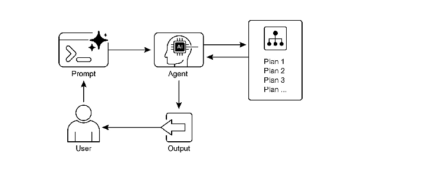

​                                                       Fig.6-1: Planning design pattern

## Key Takeaways 

- Planning enables agents to break down complex goals into actionable, sequential steps.
- 规划使智能体将复杂目标分解为可操作的顺序步骤。
- It is essential for handling multi-step tasks, workflow automation, and navigating complex environments.
- 它对于处理多步任务、工作流自动化和导航复杂环境至关重要。
- LLMs can perform planning by generating step-by-step approaches based on task descriptions.
- LLM 可以通过基于任务描述生成逐步方法来执行规划。
- Explicitly prompting or designing tasks to require planning steps encourages this behavior in agent frameworks.
- 明确提示或设计任务以要求规划步骤会在智能体框架中鼓励这种行为。
- Google Deep Research is an agent analyzing on our behalf sources obtained using Google Search as a tool. It reflects, plans, and executes.
- Google Deep Research 是一个代表我们分析使用 Google 搜索作为工具获得的来源的智能体。它进行反思、规划并执行。

## Conclusion

In conclusion, the Planning pattern is a foundational component that elevates agentic systems from simple reactive responders to strategic, goal-oriented executors. Modern large language models provide the core capability for this, autonomously decomposing high-level objectives into coherent, actionable steps. This pattern scales from straightforward, sequential task execution, as demonstrated by the CrewAI agent creating and following a writing plan, to more complex and dynamic systems. The Google DeepResearch agent exemplifies this advanced application, creating iterative research plans that adapt and evolve based on continuous information gathering. Ultimately, planning provides the essential bridge between human intent and automated execution for complex problems. By structuring a problem-solving approach, this pattern enables agents to manage intricate workflows and deliver comprehensive, synthesized results.

总之，规划模式是将智能体从简单的反应性响应者提升为战略性、目标导向的执行者的基础组件。现代大型语言模型为此提供了核心能力，自主地将高级目标分解为连贯的可操作步骤。此模式从简单的顺序任务执行（如 CrewAI智能体遵循写作计划所演示的）扩展到更复杂和动态的系统。Google DeepResearch智能体展示了高级应用，创建基于持续信息收集而适应和演化的迭代研究计划。最终，规划为复杂问题的人类意图和自动化执行之间提供了必要的桥梁。通过构建问题解决方法，此模式使智能体能够管理工作流并提供全面的综合结果。

# Chapter 7: Multi-Agent Collaboration

## At a Glance

**What:** Complex problems often exceed the capabilities of a single, monolithic LLM-based agent. A solitary agent may lack the diverse, specialized skills or access to the specific tools needed to address all parts of a multifaceted task. This limitation creates a bottleneck, reducing the system’s overall effectiveness and scalability. As a result, tackling sophisticated, multi-domain objectives becomes inefficient and can lead to incomplete or suboptimal outcomes. **是什么：** 复杂问题通常超出单个单体基于 LLM 的智能体的能力范围。单个智能体往往缺乏解决多方面任务所有部分所需的多样化专业技能或对特定工具的访问。此限制造成瓶颈，降低系统的整体效率和可扩展性。因此，处理复杂的多领域目标变得低效，并可能导致不完整或次优的结果。

**Why:** The Multi-Agent Collaboration pattern offers a standardized solution by creating a system of multiple, cooperating agents. A complex problem is broken down into smaller, more manageable sub-problems. Each sub-problem is then assigned to a specialized agent with the precise tools and capabilities required to solve it. These agents work together through defined communication protocols and interaction models like sequential handoffs, parallel workstreams, or hierarchical delegation. This agentic, distributed approach creates a synergistic effect, allowing the group to achieve outcomes that would be impossible for any single agent. **为什么：** 多智能体协作模式通过创建多个协作智能体的系统提供了标准化解决方案。复杂问题被分解为更小、更易于管理的子问题。然后将每个子问题分配给具有解决它所需的精确工具和能力的专门智能体。这些智能体通过精心设计的通信协议和交互模型（如顺序交接、并行工作流或层次化委托）协同工作。这种模块化的智能体方法创造了协同效应，使团队能够实现任何单个智能体都无法单独实现的成果。

**Rule of thumb:** Use this pattern when a task is too complex for a single agent and can be decomposed into distinct sub-tasks requiring specialized skills or tools. It is ideal for problems that benefit from diverse expertise, parallel processing, or a structured workflow with multiple stages, such as complex research and analysis, software development, or creative content generation. **经验法则：** 当任务对于单个智能体太复杂并且可以分解为需要专业技能或工具的不同子任务时，使用此模式。它非常适合受益于多样化专业知识、并行处理或具有多个阶段的结构化工作流的问题，例如复杂的研究和分析、软件开发或创意内容生成。

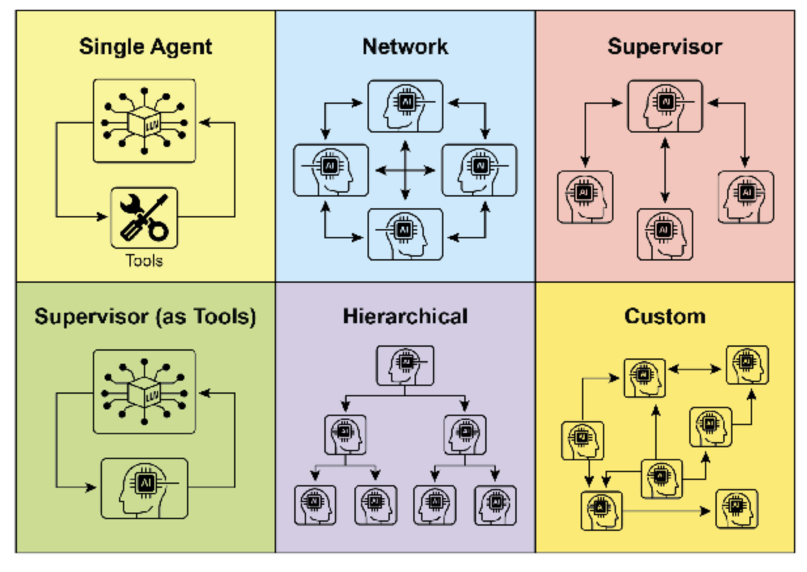

​            Fig. 7-1: Agents communicate and interact in various ways. 

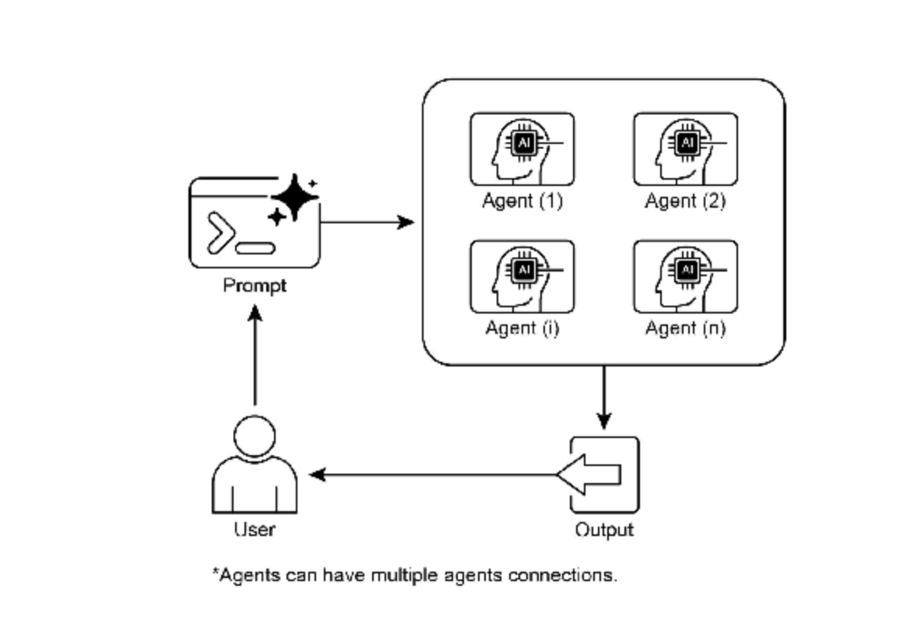

​                               Fig.7-2: Multi-Agent design pattern

## Key Takeaways 

- Multi-agent collaboration involves multiple agents working together to achieve a common goal.
- 多智能体协作涉及多个智能体协同工作以实现共同目标。
- This pattern leverages specialized roles, distributed tasks, and inter-agent communication.
- 此模式利用专业角色、分布式任务和智能体间通信。
- Collaboration can take forms like sequential handoffs, parallel processing, debate, or hierarchical structures.
- 协作可以采取顺序交接、并行处理、辩论或层次结构等形式。
- This pattern is ideal for complex problems requiring diverse expertise or multiple distinct stages.
- 此模式非常适合需要多样化专业知识或多个不同阶段的复杂问题。

## Conclusion

This chapter explored the Multi-Agent Collaboration pattern, demonstrating the benefits of orchestrating multiple specialized agents within systems. We examined various collaboration models, emphasizing the pattern’s essential role in addressing complex, multifaceted problems across diverse domains. Understanding agent collaboration naturally leads to an inquiry into their interactions with the external environment.

本章探讨了多智能体协作模式，展示了在系统内编排多个专门智能体的强大之处。我们研究了各种协作模型，强调该模式在跨不同领域解决复杂多方面问题中的关键作用。理解智能体间的交互自然会引出对其与外部环境交互的探究。

# Chapter 8: Memory Managment

## At a Glance

**What**: Agentic systems need to remember information from past interactions to perform complex tasks and provide coherent experiences. Without a memory mechanism, agents are stateless, unable to maintain conversational context, learn from experience, or personalize responses for users. This fundamentally limits them to simple, one-shot interactions, failing to handle multi-step processes or evolving user needs. The core problem is how to effectively manage both the immediate, temporary information of a single conversation and the vast, persistent knowledge gathered over time.

**是什么：**智能体需要记住过去交互信息以执行复杂任务并提供连贯体验。缺乏记忆机制时，Agent 无法维护对话上下文、从经验中学习或提供个性化响应，被限制在简单的一次性交互中，无法处理多步骤过程或变化需求。核心问题是如何有效管理单个对话的即时临时信息和随时间积累的持久知识。

**Why:** The standardized solution is to implement a dual-component memory system that distinguishes between short-term and long-term storage. Short-term, contextual memory holds recent interaction data within the LLM’s context window to maintain conversational flow. For information that must persist, long-term memory solutions use external databases, often vector stores, for efficient, semantic retrieval. Agentic frameworks like the Google ADK provide specific components to manage this, such as Session for the conversation thread and State for its temporary data. A dedicated MemoryService is used to interface with the long-term knowledge base, allowing the agent to retrieve and incorporate relevant past information into its current context.

**为什么：** 标准化解决方案是实现区分短期和长期存储的双组件记忆系统：短期上下文记忆在 LLM 窗口内保存最近交互以维护对话流；长期记忆使用外部数据库（如向量存储）实现高效的语义检索。Google ADK 等框架提供特定组件来管理此过程（如 Session 管理对话线程，State 处理临时数据）。专用的 MemoryService 与长期知识库交互，允许智能体将相关的过去信息纳入当前上下文。

**Rule of thumb:** Use this pattern when an agent needs to do more than answer a single question. It is essential for agents that must maintain context throughout a conversation, track progress in multi-step tasks, or personalize interactions by recalling user preferences and history. Implement memory management whenever the agent is expected to learn or adapt based on past successes, failures, or newly acquired information.

**经验法则：** 当智能体做更多事情（不仅是回答单个问题）时使用此模式。对于需维护对话上下文、跟踪多步骤任务进度或通过回忆用户偏好历史来提供个性化交互的 Agent，此模式必不可少。当智能体从过去的成功/失败或新信息中学习并适应时，应实现记忆管理。

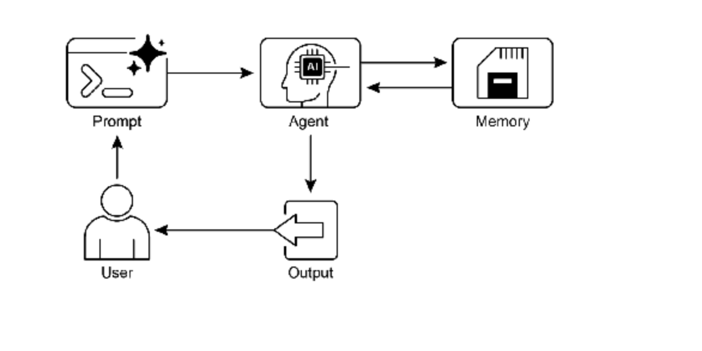

​                                            Fig.8-1: Memory management design pattern

## Key Takeaways 

- Memory is super important for agents to keep track of things, learn, and personalize interactions.
- 记忆对于智能体处理事务、学习和个性化交互至关重要。
- Conversational AI relies on both short-term memory for immediate context within a single chat and long-term memory for persistent knowledge across multiple sessions.
- 对话式 AI 依赖单个聊天中即时上下文的短期记忆和跨多个会话持久知识的长期记忆。
- Short-term memory (the immediate stuff) is temporary, often limited by the LLM’s context window or how the framework passes context.
- 短期记忆（即时信息）是临时的，通常受 LLM 上下文窗口或框架传递上下文方式的限制。
- Long-term memory (the stuff that sticks around) saves info across different chats using outside storage like vector databases and is accessed by searching.
- 长期记忆（持久信息）使用向量数据库等外部存储跨不同聊天保存信息，并通过搜索访问。
- Frameworks like ADK have specific parts like Session (the chat thread), State (temporary chat data), and MemoryService (the searchable long-term knowledge) to manage memory.
- 像 ADK 这样的框架具有特定部分，如 Session（聊天线程）、State（临时聊天数据）和 MemoryService（可搜索的长期知识）来管理记忆。
- ADK’s SessionService handles the whole life of a chat session, including its history (events) and temporary data (state).
- ADK 的 SessionService 处理聊天会话的整个生命周期，包括其历史（events）和临时数据（state）。
- ADK’s session.state is a dictionary for temporary chat data. Prefixes (user:, app:, temp:) tell you where the data belongs and if it sticks around.
- ADK 的 session.state 是临时聊天数据的字典。前缀（user:、app:、temp:）指示数据归属位置及是否持久。
- In ADK, you should update state by using EventActions.state_delta or output_key when adding events, not by changing the state dictionary directly.
- 在 ADK 中，应通过在添加事件时使用 EventActions.state_delta 或 output_key 更新状态，而非直接更改状态字典。
- ADK’s MemoryService is for putting info into long-term storage and letting agents search it, often using tools.
- ADK 的 MemoryService 用于将信息放入长期存储并让智能体检索，通常使用工具。
- LangChain offers practical tools like ConversationBufferMemory to automatically inject the history of a single conversation into a prompt, enabling an agent to recall immediate context.
- LangChain 提供如 ConversationBufferMemory 的实用工具，自动将单个对话历史注入提示，使智能体回忆即时上下文。
- LangGraph enables advanced, long-term memory by using a store to save and retrieve semantic facts, episodic experiences, or even updatable procedural rules across different user sessions.
- LangGraph 通过使用存储来保存和检索跨不同用户会话的语义事实、情景经验甚至可更新的程序规则，实现高级长期记忆。
- Memory Bank is a managed service that provides agents with persistent, long-term memory by automatically extracting, storing, and recalling user-specific information to enable personalized, continuous conversations across frameworks like Google’s ADK, LangGraph, and CrewAI.
- Memory Bank 是托管服务，通过自动提取、存储和调用用户特定信息为智能体提供持久长期记忆，在 Google 的 ADK、LangGraph 和 CrewAI 等框架中实现个性化的持续对话。

## Conclusion

This chapter dove into the really important job of memory management for agent systems, showing the difference between the short-lived context and the knowledge that sticks around for a long time. We talked about how these types of memory are set up and where you see them used in building smarter agents that can remember things. We took a detailed look at how Google ADK gives you specific pieces like Session, State, and MemoryService to handle this. Now that we’ve covered how agents can remember things, both short-term and long-term, we can move on to how they can learn and adapt. The next pattern ”Learning and Adaptation” is about an agent changing how it thinks, acts, or what it knows, all based on new experiences or data.

本章深入探讨智能体记忆管理，展示了短暂上下文与长期持久知识之间的区别。我们讨论了这些记忆类型的设置方式以及在构建更智能智能体中的应用。详细了解了 Google ADK 如何通过 Session、State 和 MemoryService 等组件处理此过程。既然已介绍智能体如何管理记忆（短期和长期），我们将继续探讨其如何学习和适应。下一模式”学习和适应”关注智能体如何根据智能体数据改变思考、行动或知识。

# Chapter 9: Learning and Adaptation 

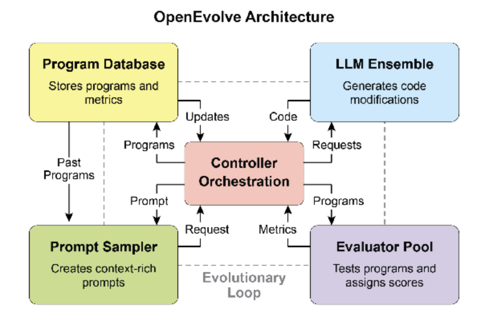

Fig. 9-1: The OpenEvolve internal architecture is managed by a controller. This controller orchestrates several key components: the program sampler, Program Database, Evaluator Pool, and LLM Ensembles. Its primary function is to facilitate their learning and adaptation processes to enhance code quality.

## At a Glance

**What:** AI agents often operate in dynamic and unpredictable environments where pre-programmed logic is insufficient. Their performance can degrade when faced with novel situations not anticipated during their initial design. Without the ability to learn from experience, agents cannot optimize their strategies or personalize their interactions over time. This rigidity limits their effectiveness and prevents them from achieving true autonomy in complex, real-world scenarios.

**是什么：** AI 智能体通常在动态且不可预测的环境中运行，在这些环境中预编程逻辑是不够的。当面对初始设计期间未预料到的新情况时，它们的性能可能会下降。没有从经验中学习的能力，智能体无法随时间优化其策略或个性化其交互。这种刚性限制了它们的有效性，并阻止它们在复杂的现实世界场景中实现真正的自主性。

**Why:** The standardized solution is to integrate learning and adaptation mechanisms, transforming static agents into dynamic, evolving systems. This allows an agent to autonomously refine its knowledge and behaviors based on new data and interactions. Agentic systems can use various methods, from reinforcement learning to more advanced techniques like self-modification, as seen in the Self-Improving Coding Agent (SICA). Advanced systems like Google’s AlphaEvolve leverage LLMs and evolutionary algorithms to discover entirely new and more efficient solutions to complex problems. By continuously learning, agents can master new tasks, enhance their performance, and adapt to changing conditions without requiring constant manual reprogramming.

**为什么：** 标准化解决方案是集成学习和适应机制，将静态智能体转变为动态的、演化的系统。这使智能体能够基于新数据和交互自主改进其知识和行为。智能体系统可以使用各种方法，从强化学习到更高级的技术，如自我改进编码智能体（SICA）中所见的自我修改。像 Google 的 AlphaEvolve 这样的高级系统利用 LLM 和进化算法来发现全新的、更高效的复杂问题解决方案。通过持续学习，智能体可以掌握新任务、增强其性能并适应变化的条件，而无需持续的手动重新编程。

**Rule of thumb:** Use this pattern when building agents that must operate in dynamic, uncertain, or evolving environments. It is essential for applications requiring personalization, continuous performance improvement, and the ability to handle novel situations autonomously.

**经验法则：** 在构建必须在动态、不确定或演化环境中运行的智能体时使用此模式。它对于需要个性化、持续性能改进以及自主处理新情况的能力的应用至关重要。

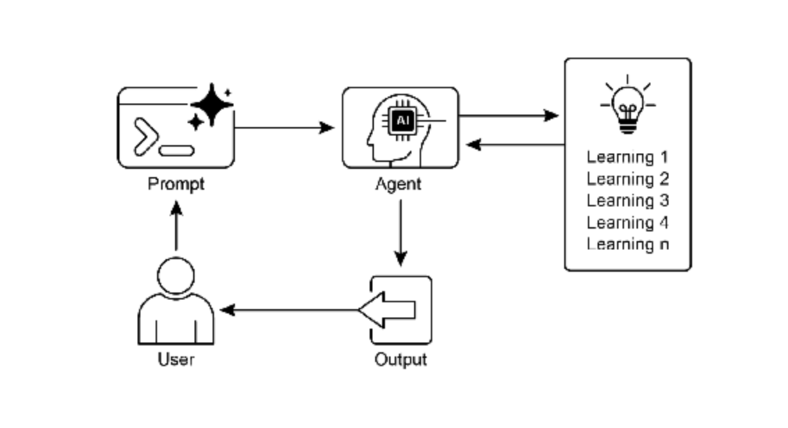

​                            Fig.9-2: Learning and adapting pattern

## Key Takeaways 

- Learning and Adaptation are about agents getting better at what they do and handling new situations by using their experiences.
- “Adaptation” is the visible change in an agent’s behavior or knowledge that comes from learning.
- SICA, the Self-Improving Coding Agent, self-improves by modifying its code based on past performance. This led to tools like the Smart Editor and AST Symbol Locator.
- Having specialized “sub-agents” and an “overseer” helps these self-improving systems manage big tasks and stay on track.
- The way an LLM’s “context window” is set up (with system prompts, core prompts, and assistant messages) is super important for how efficiently agents work.
- This pattern is vital for agents that need to operate in environments that are always changing, uncertain, or require a personal touch.
- Building agents that learn often means hooking them up with machine learning tools and managing how data flows.
- An agent system, equipped with basic coding tools, can autonomously edit itself, and thereby improve its performance on benchmark tasks
- AlphaEvolve is Google’s AI agent that leverages LLMs and an evolutionary framework to autonomously discover and optimize algorithms, significantly enhancing both fundamental research and practical computing applications.
- 学习和适应是智能体通过经验改进自身行为并处理新情况的过程
- “适应”是学习导致的智能体行为或知识的可见变化
- 自我改进编码智能体（SICA）通过基于过去表现修改代码进行自我改进，产生了智能编辑器、AST 符号定位器等工具
- 拥有专门的”子智能体”和”监督者”有助于这些自我改进系统管理大型任务并保持正轨
- LLM 上下文窗口的设置方式（使用系统提示词、核心提示词和助手消息）对智能体的工作效率至关重要
- 此模式对于需要在不断变化、不确定或需要个性化的环境中运行的智能体至关重要
- 构建学习型智能体通常意味着将它们与机器学习工具连接起来并管理数据流动方式
- 配备基本编码工具的智能体系统可以自主编辑自身，从而提高其在基准任务上的性能
- AlphaEvolve 是 Google 的 AI 智能体，利用 LLM 和进化框架自主发现和优化算法，显著增强基础研究和实际计算应用

## Conclusion

This chapter examines the crucial roles of learning and adaptation in Artificial Intelligence. AI agents enhance their performance through continuous data acquisition and experience. The Self-Improving Coding Agent (SICA) exemplifies this by autonomously improving its capabilities through code modifications.

本章探讨了学习和适应在人工智能中的关键作用。AI 智能体通过持续的数据获取和经验来增强其性能。自我改进编码智能体（SICA）通过代码修改自主改进其能力，很好地例证了这一点。

We have reviewed the fundamental components of agentic AI, including architecture, applications, planning, multi-agent collaboration, memory management, and learning and adaptation. Learning principles are particularly vital for coordinated improvement in multi-agent systems. To achieve this, tuning data must accurately reflect the complete interaction trajectory, capturing the individual inputs and outputs of each participating agent.

我们已经回顾了智能体 AI 的基本组成部分，包括架构、应用、规划、多智能体协作、记忆管理以及学习和适应。学习原理对于多智能体系统的协调改进特别重要。要实现这一点，调优数据必须准确反映完整的交互轨迹，捕获每个参与智能体的输入和输出。

These elements contribute to significant advancements, such as Google’s AlphaEvolve. This AI system independently discovers and refines algorithms by LLMs, automated assessment, and an evolutionary approach, driving progress in scientific research and computational techniques. Such patterns can be combined to construct sophisticated AI systems. Developments like AlphaEvolve demonstrate that autonomous algorithmic discovery and optimization by AI agents are attainable.

这些元素促成了重大进展，如 Google 的 AlphaEvolve。这个 AI 系统通过 LLM、自动化评估和进化方法独立发现和改进算法，推动科学研究和计算技术的进步。这些模式可以组合起来构建复杂的 AI 系统。像 AlphaEvolve 这样的发展表明，AI 智能体自主算法发现和优化是可以实现的。

# Chapter 10: Model Context Protocl 

## At a Glance

**What:** To function as effective agents, LLMs must move beyond simple text generation. They require the ability to interact with the external environment to access current data and utilize external software. Without a standardized communication method, each integration between an LLM and an external tool or data source becomes a custom, complex, and non-reusable effort. This ad-hoc approach hinders scalability and makes building complex, interconnected AI systems difficult and inefficient.

**是什么**：要作为有效的智能体，LLM 必须超越简单的文本生成。它们需要与外部环境交互的能力，以访问当前数据并使用外部软件。如果没有标准化的通信方法，LLM 与外部工具或数据源之间的每次集成都将成为定制、复杂且不可重用的工作。这种临时方法阻碍了可扩展性，并使构建复杂、互联的 AI 系统变得困难且低效。

**Why:** The Model Context Protocol (MCP) offers a standardized solution by acting as a universal interface between LLMs and external systems. It establishes an open, standardized protocol that defines how external capabilities are discovered and used. Operating on a client-server model, MCP allows servers to expose tools, data resources, and interactive prompts to any compliant client. LLM-powered applications act as these clients, dynamically discovering and interacting with available resources in a predictable manner. This standardized approach fosters an ecosystem of interoperable and reusable components, dramatically simplifying the development of complex agentic workflows.

**为什么**：模型上下文协议（MCP）通过充当 LLM 和外部系统之间的通用接口，提供了标准化的解决方案。它建立了一个开放的标准化协议，定义了如何发现和使用外部能力。基于客户端-服务器模型运行，MCP 允许服务器向任何兼容的客户端公开工具、数据资源和交互式提示。LLM 驱动的应用程序充当这些客户端，以可预测的方式动态发现和与可用资源交互。这种标准化方法促进了可互操作和可重用组件的生态系统，显著简化了复杂智能体工作流的开发。

**Rule of thumb:** Use the Model Context Protocol (MCP) when building complex, scalable, or enterprise-grade agentic systems that need to interact with a diverse and evolving set of external tools, data sources, and APIs. It is ideal when interoperability between different LLMs and tools is a priority, and when agents require the ability to dynamically discover new capabilities without being redeployed. For simpler applications with a fixed and limited number of predefined functions, direct tool function calling may be sufficient.

**经验法则**：在构建需要与各种不断发展的外部工具、数据源和 API 交互的复杂、可扩展或企业级智能体系统时，使用模型上下文协议（MCP）。当不同 LLM 和工具之间的互操作性是优先考虑事项时，以及当智能体需要动态发现新能力而无需重新部署时，它是理想选择。对于具有固定有限数量预定义函数的简单应用程序，直接工具函数调用可能就足够了。

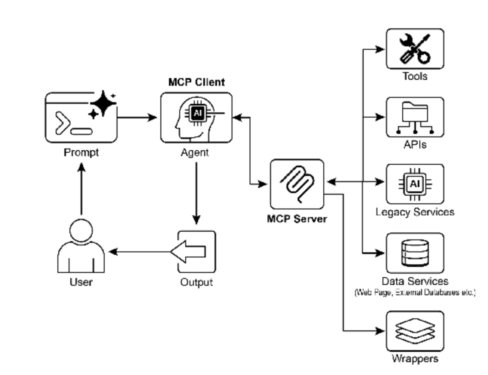

## Key Takeaways 

- The Model Context Protocol (MCP) is an open standard facilitating standardized communication between LLMs and external applications, data sources, and tools.
- 模型上下文协议（MCP）是一个开放标准，促进 LLM 与外部应用程序、数据源和工具之间的标准化通信。
- It employs a client-server architecture, defining the methods for exposing and consuming resources, prompts, and tools.
- 它采用客户端-服务器架构，定义了公开和使用资源、提示和工具的方法。
- The Agent Development Kit (ADK) supports both utilizing existing MCP servers and exposing ADK tools via an MCP server.
- 智能体开发工具包（ADK）支持使用现有 MCP 服务器以及通过 MCP 服务器公开 ADK 工具。
- FastMCP simplifies the development and management of MCP servers, particularly for exposing tools implemented in Python.
- FastMCP 简化了 MCP 服务器的开发和管理，特别是用于公开在 Python 中实现的工具。
- MCP Tools for Genmedia Services allows agents to integrate with Google Cloud’s generative media capabilities (Imagen, Veo, Chirp 3 HD, Lyria).
- 生成媒体服务的 MCP 工具允许智能体与 Google Cloud 的生成媒体能力（Imagen、Veo、Chirp 3 HD、Lyria）集成。
- MCP enables LLMs and agents to interact with real-world systems, access dynamic information, and perform actions beyond text generation.
- MCP 使 LLM 和智能体能够与现实世界系统交互，访问动态信息，并执行超越文本生成的操作。

## Conclusion

The Model Context Protocol (MCP) is an open standard that facilitates communication between Large Language Models (LLMs) and external systems. It employs a client-server architecture, enabling LLMs to access resources, utilize prompts, and execute actions through standardized tools. MCP allows LLMs to interact with databases, manage generative media workflows, control IoT devices, and automate financial services. Practical examples demonstrate setting up agents to communicate with MCP servers, including filesystem servers and servers built with FastMCP, illustrating its integration with the Agent Development Kit (ADK). MCP is a key component for developing interactive AI agents that extend beyond basic language capabilities.

模型上下文协议（MCP）是一个开放标准，促进大型语言模型（LLM）与外部系统之间的通信。它采用客户端-服务器架构，使 LLM 能够通过标准化工具访问资源、使用提示和执行操作。MCP 允许 LLM 与数据库交互、管理生成媒体工作流、控制物联网设备以及自动化金融服务。实际示例演示了设置智能体与 MCP 服务器通信的方法，包括文件系统服务器和使用 FastMCP 构建的服务器，说明了其与智能体开发工具包（ADK）的集成。MCP 是开发超越基本语言能力的交互式 AI 智能体的关键组件。

# Chapter 11: Goal Setting and Monitoring

## At a Glance

**What**: AI agents often lack a clear direction, preventing them from acting with purpose beyond simple, reactive tasks. Without defined objectives, they cannot independently tackle complex, multi-step problems or orchestrate sophisticated workflows. Furthermore, there is no inherent mechanism for them to determine if their actions are leading to a successful outcome. This limits their autonomy and prevents them from being truly effective in dynamic, real-world scenarios where mere task execution is insufficient.

**问题背景**：AI 智能体通常缺乏明确的方向，阻碍了它们在简单反应性任务之外采取有目的的行动。如果没有定义的目标，它们无法独立处理复杂的多步骤问题或编排复杂的工作流。此外，它们没有内在的机制来确定其行动是否导致成功的结果。这限制了它们的自主性，并阻止它们在仅执行任务不足的动态现实世界场景中真正有效。

**Why**: The Goal Setting and Monitoring pattern provides a standardized solution by embedding a sense of purpose and self-assessment into agentic systems. It involves explicitly defining clear, measurable objectives for the agent to achieve. Concurrently, it establishes a monitoring mechanism that continuously tracks the agent’s progress and the state of its environment against these goals. This creates a crucial feedback loop, enabling the agent to assess its performance, correct its course, and adapt its plan if it deviates from the path to success. By implementing this pattern, developers can transform simple reactive agents into proactive, goal-oriented systems capable of autonomous and reliable operation.

**解决方案**：目标设定与监控模式通过将目的感和自我评估嵌入智能体系统来提供标准化的解决方案。它涉及为智能体明确定义清晰、可衡量的目标。同时，它建立了一个监控机制，持续跟踪智能体的进度和环境状态，并与这些目标进行对比。这创建了一个关键的反馈循环，使智能体能够评估其表现、纠正其路线，并在偏离成功之路时调整其计划。通过实施此模式，开发人员可以将简单的反应智能体转变为能够自主可靠运行的主动的、以目标为导向的系统。

**Rule of thumb**: Use this pattern when an AI agent must autonomously execute a multi-step task, adapt to dynamic conditions, and reliably achieve a specific, high-level objective without constant human intervention.

**实践建议**：当 AI 智能体需要自主执行多步骤任务、适应动态条件并在没有持续人工干预的情况下可靠地实现特定的高级目标时，使用此模式。

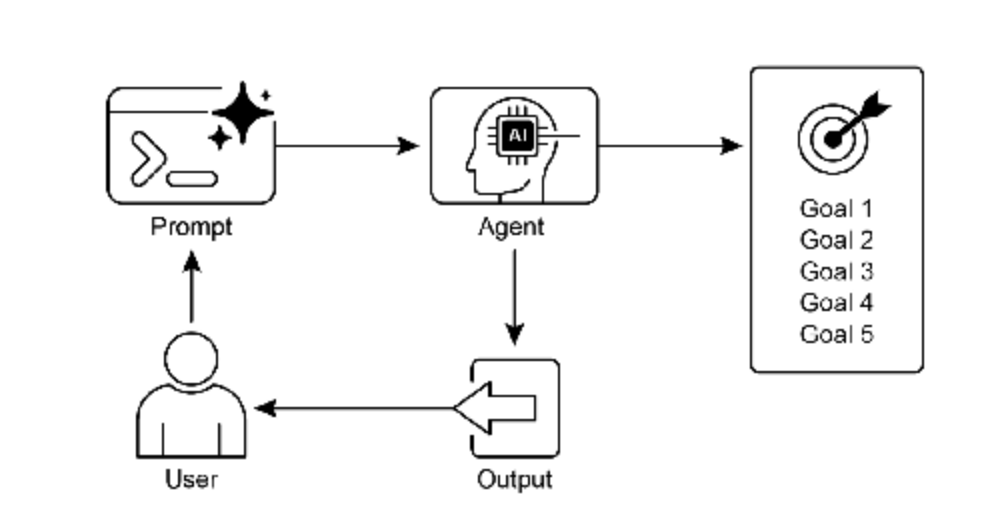

## Key Takeaways 

Key takeaways include: 关键要点包括：

- Goal Setting and Monitoring equips agents with purpose and mechanisms to track progress.
- Goals should be specific, measurable, achievable, relevant, and time-bound (SMART).
- Clearly defining metrics and success criteria is essential for effective monitoring.
- Monitoring involves observing agent actions, environmental states, and tool outputs.
- Feedback loops from monitoring allow agents to adapt, revise plans, or escalate issues.
- In Google’s ADK, goals are often conveyed through agent instructions, with monitoring accomplished through state management and tool interactions.
- 目标设定与监控为智能体配备了目的感和跟踪进度的机制。
- 目标应该是具体的、可衡量的、可实现的、相关的和有时限的（SMART）。
- 清楚地定义指标和成功标准对于有效监控至关重要。
- 监控涉及观察智能体的行动、环境状态和工具输出。
- 来自监控的反馈循环允许智能体适应、修订计划或升级问题。
- 在 Google 的 ADK 中，目标通常通过智能体指令传达，监控通过状态管理和工具交互完成。

## Conclusion

This chapter focused on the crucial paradigm of Goal Setting and Monitoring. I highlighted how this concept transforms AI agents from merely reactive systems into proactive, goal-driven entities. The text emphasized the importance of defining clear, measurable objectives and establishing rigorous monitoring procedures to track progress. Practical applications demonstrated how this paradigm supports reliable autonomous operation across various domains, including customer service and robotics. A conceptual coding example illustrates the implementation of these principles within a structured framework, using agent directives and state management to guide and evaluate an agent’s achievement of its specified goals. Ultimately, equipping agents with the ability to formulate and oversee goals is a fundamental step toward building truly intelligent and accountable AI systems.

本章重点介绍了目标设定与监控的关键范式。我们强调了这个概念如何将 AI 智能体从仅是反应系统转变为主动的、以目标为驱动的实体。文本强调了定义清晰、可衡量的目标以及建立严格的监控程序来跟踪进度的重要性。实际应用展示了这个范式如何支持在各个领域（包括客户服务和机器人）的可靠自主运行。一个概念性的编码示例说明了这些原则在结构化框架内的实现，使用智能体指令和状态管理来指导和评估智能体对指定目标的实现。最终，为智能体配备制定和监督目标的能力是构建真正智能和负责任的 AI 系统的基本步骤。

# Chapter 12: Exception Handing and Recovery

## At a Glance

**What:** AI agents operating in real-world environments inevitably encounter unforeseen situations, errors, and system malfunctions. These disruptions can range from tool failures and network issues to invalid data, threatening the agent’s ability to complete its tasks. Without a structured way to manage these problems, agents can be fragile, unreliable, and prone to complete failure when faced with unexpected hurdles. This unreliability makes it difficult to deploy them in critical or complex applications where consistent performance is essential.

**问题背景**：在现实世界环境中运行的 AI 智能体不可避免地会遇到不可预见的情况、错误和系统故障。这些中断可能从工具故障、网络问题到无效数据不等，威胁着智能体完成任务的能力。如果没有结构化的方法来管理这些问题，智能体可能会变得脆弱、不可靠，并且在面对意外障碍时容易完全失败。这种不可靠性使得难以在一致性能至关重要的关键或复杂应用程序中部署它们。

**Why**: The Exception Handling and Recovery pattern provides a standardized solution for building robust and resilient AI agents. It equips them with the agentic capability to anticipate, manage, and recover from operational failures. The pattern involves proactive error detection, such as monitoring tool outputs and API responses, and reactive handling strategies like logging for diagnostics, retrying transient failures, or using fallback mechanisms. For more severe issues, it defines recovery protocols, including reverting to a stable state, self-correction by adjusting its plan, or escalating the problem to a human operator. This systematic approach ensures agents can maintain operational integrity, learn from failures, and function dependably in unpredictable settings.

**解决方案**：异常处理和恢复模式为构建强大和有弹性的 AI 智能体提供了标准化的解决方案。它为它们配备了预测、管理和从操作失败中恢复的智能体能力。此模式涉及主动错误检测，例如监控工具输出和 API 响应，以及响应处理策略，如用于诊断的日志记录、重试瞬态故障或使用回退机制。对于更严重的问题，它定义了恢复协议，包括恢复到稳定状态、通过调整其计划进行自我纠正或将问题升级给人类操作员。这种系统方法确保智能体保持操作完整性，从失败中学习，并在不可预测的环境中可靠地运作。

**Rule of thumb:** Use this pattern for any AI agent deployed in a dynamic, real-world environment where system failures, tool errors, network issues, or unpredictable inputs are possible and operational reliability is a key requirement.

**实践建议**：对于在动态的现实世界环境中部署的任何 AI 智能体，当系统故障、工具错误、网络问题或不可预测的输入可能发生且操作可靠性是关键要求时，使用此模式。

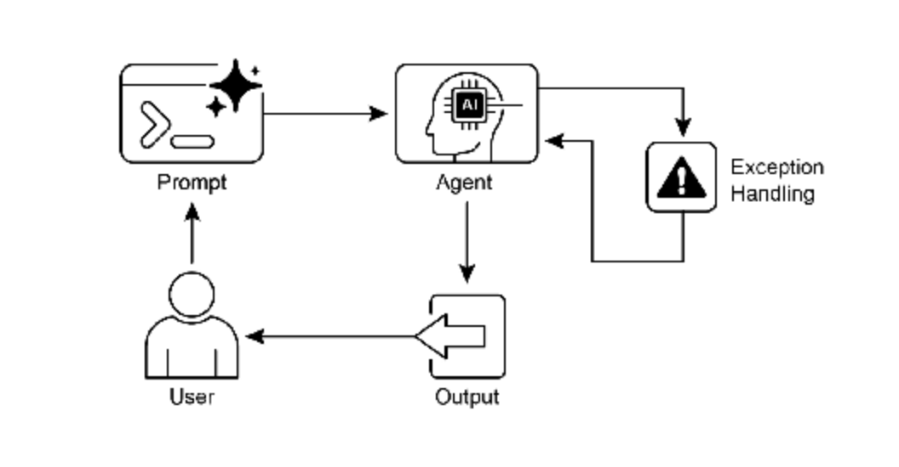

## Key Takeaways 

- Exception Handling and Recovery is essential for building robust and reliable Agents.
- 异常处理和恢复对于构建强大和可靠的智能体非常重要。
- This pattern involves detecting errors, handling them gracefully, and implementing strategies to recover.
- 此模式涉及检测错误、优雅地处理错误以及实施恢复策略。
- Error detection can involve validating tool outputs, checking API error codes, and using timeouts.
- 错误检测可能涉及验证工具输出、检查 API 错误代码以及使用超时。
- Handling strategies include logging, retries, fallbacks, graceful degradation, and notifications.
- 处理策略包括日志记录、重试、回退、优雅降级和通知。
- Recovery focuses on restoring stable operation through diagnosis, self-correction, or escalation.
- 恢复侧重于通过诊断、自我纠正或升级恢复稳定运行。
- This pattern ensures agents can operate effectively even in unpredictable real-world environments.
- 此模式确保智能体在不可预测的现实世界环境中也能有效运行。

## Conclusion

This chapter explores the Exception Handling and Recovery pattern, which is essential for developing robust and dependable AI agents. This pattern addresses how AI agents can identify and manage unexpected issues, implement appropriate responses, and recover to a stable operational state. The chapter discusses various aspects of this pattern, including the detection of errors, the handling of these errors through mechanisms such as logging, retries, and fallbacks, and the strategies used to restore the agent or system to proper function. Practical applications of the Exception Handling and Recovery pattern are illustrated across several domains to demonstrate its relevance in handling real-world complexities and potential failures. These applications show how equipping AI agents with exception handling capabilities contributes to their reliability and adaptability in dynamic environments.

本章探讨了异常处理和恢复模式，这对于开发强大和可靠的 AI 智能体非常重要。此模式解决了 AI 智能体如何识别和管理意外问题、实施适当的响应以及恢复到稳定操作状态的需求。本章讨论了此模式的各个方面，包括错误的检测、通过日志记录、重试和回退等机制处理这些错误，以及用于将智能体或系统恢复到正常功能的策略。异常处理和恢复模式的实际应用在多个领域中得到说明，展示了其在处理现实世界复杂性和潜在失败方面的相关性。这些应用展示了为 AI 智能体配备异常处理能力如何有助于它们在动态环境中的可靠性和适应性。

# Chapter 13: Human-in-the-loop

**What:** AI systems, including advanced LLMs, often struggle with tasks that require nuanced judgment, ethical reasoning, or a deep understanding of complex, ambiguous contexts. Deploying fully autonomous AI in high-stakes environments carries significant risks, as errors can lead to severe safety, financial, or ethical consequences. These systems lack the inherent creativity and common-sense reasoning that humans possess. Consequently, relying solely on automation in critical decision-making processes is often imprudent and can undermine the system’s overall effectiveness and trustworthiness.

**问题背景：** AI 系统（包括高级 LLM）通常在需要细致入微判断、道德推理或对复杂模糊上下文深刻理解的任务中表现不佳。在高风险环境中部署完全自主的 AI 具有重大风险，因为错误可能导致严重的安全、财务或道德后果。这些系统缺乏人类固有的创造力和常识推理能力。因此，在关键决策过程中仅依赖自动化通常是不明智的，并可能损害系统的整体有效性和可信度。

**Why:** The Human-in-the-Loop (HITL) pattern provides a standardized solution by strategically integrating human oversight into AI workflows. This agentic approach creates a symbiotic partnership where AI handles computational heavy-lifting and data processing, while humans provide critical validation, feedback, and intervention. By doing so, HITL ensures that AI actions align with human values and safety protocols. This collaborative framework not only mitigates the risks of full automation but also enhances the system’s capabilities through continuous learning from human input. Ultimately, this leads to more robust, accurate, and ethical outcomes that neither human nor AI could achieve alone.

**解决方案：** 人机协同（HITL）模式通过战略性地将人类监督整合到 AI 工作流中提供了标准化解决方案。这种智能体方法创建了共生伙伴关系，AI 处理计算繁重工作和数据处理，而人类提供关键验证、反馈和干预。通过这样做，HITL 确保 AI 行动与人类价值观和安全协议保持一致。这种协作框架不仅降低了完全自动化的风险，还通过从人类输入中持续学习来增强系统能力。最终，这带来了更强大、准确和道德的结果，这些结果是人类或 AI 单独无法实现的。

**Rule of thumb:** Use this pattern when deploying AI in domains where errors have significant safety, ethical, or financial consequences, such as in healthcare, finance, or autonomous systems. It is essential for tasks involving ambiguity and nuance that LLMs cannot reliably handle, like content moderation or complex customer support escalations. Employ HITL when the goal is to continuously improve an AI model with high-quality, human-labeled data or to refine generative AI outputs to meet specific quality standards.

**实践建议：** 在部署 AI 到错误会产生重大安全、道德或财务后果的领域时使用此模式，例如医疗保健、金融或自主系统。对于涉及 LLM 无法可靠处理的模糊性和细微差别的任务（如内容审核或复杂客户支持升级），它至关重要。当目标是使用高质量人类标注数据持续改进 AI 模型或完善生成 AI 输出以满足特定质量标准时，采用 HITL。

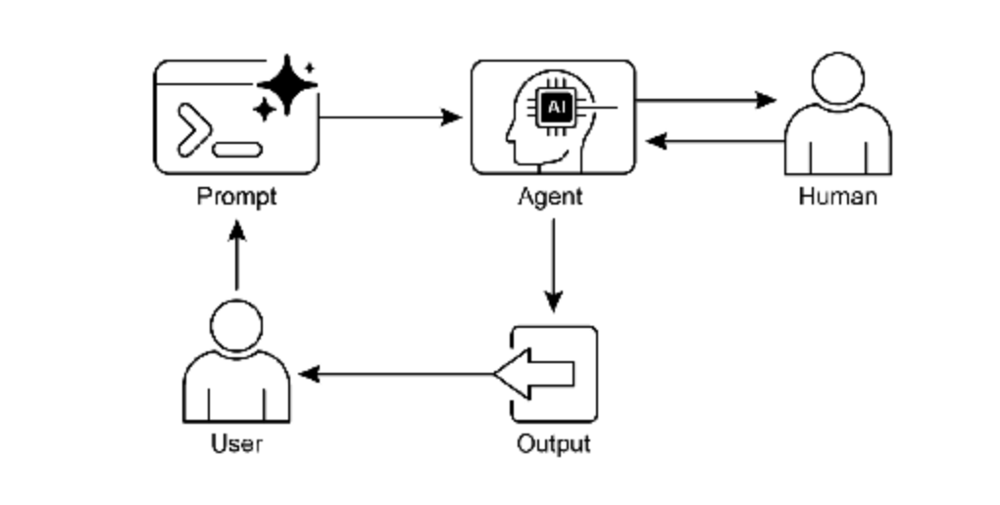

## Key Takeaways

- Human-in-the-Loop (HITL) integrates human intelligence and judgment into AI workflows.
- 人机协同（HITL）将人类智能和判断整合到 AI 工作流中。
- It’s crucial for safety, ethics, and effectiveness in complex or high-stakes scenarios.
- 它在复杂或高风险场景中对安全性、道德和有效性至关重要。
- Key aspects include human oversight, intervention, feedback for learning, and decision augmentation.
- 关键方面包括人类监督、干预、学习反馈和决策增强。
- Escalation policies are essential for agents to know when to hand off to a human.
- 升级策略对于智能体何时交接给人类至关重要。
- HITL allows for responsible AI deployment and continuous improvement.
- HITL 允许负责任的 AI 部署和持续改进。
- The primary drawbacks of Human-in-the-Loop are its inherent lack of scalability, creating a trade-off between accuracy and volume, and its dependence on highly skilled domain experts for effective intervention.
- 人机协同的主要缺点是其固有的可扩展性不足，在准确性和数量之间造成权衡，以及对高技能领域专家进行有效干预的依赖性。
- Its implementation presents operational challenges, including the need to train human operators for data generation and to address privacy concerns by anonymizing sensitive information.
- 其实施带来了操作挑战，包括需要培训人类操作员进行数据生成，以及通过匿名化敏感信息来解决隐私问题。

## Conclusion

This chapter explored the vital Human-in-the-Loop (HITL) pattern, emphasizing its role in creating robust, safe, and ethical AI systems. We discussed how integrating human oversight, intervention, and feedback into agent workflows can significantly enhance their performance and trustworthiness, especially in complex and sensitive domains. The practical applications demonstrated HITL’s widespread utility, from content moderation and medical diagnosis to autonomous driving and customer support. The conceptual code example provided a glimpse into how ADK can facilitate these human-agent interactions through escalation mechanisms. As AI capabilities continue to advance, HITL remains a cornerstone for responsible AI development, ensuring that human values and expertise remain central to intelligent system design.

本章探讨了至关重要的人机协同（HITL）模式，强调了其在创建强大、安全和道德的 AI 系统中的作用。我们讨论了如何将人类监督、干预和反馈整合到智能体工作流中可以显著增强其性能和可信度，特别是在复杂和敏感的领域中。实际应用展示了 HITL 的广泛实用性，从内容审核和医疗诊断到自动驾驶和客户支持。概念性代码示例提供了 ADK 如何通过升级机制促进这些人机交互的一瞥。随着 AI 能力不断进步，HITL 仍然是负责任的 AI 开发的基石，确保人类价值观和专业知识在智能系统设计中保持核心地位。
