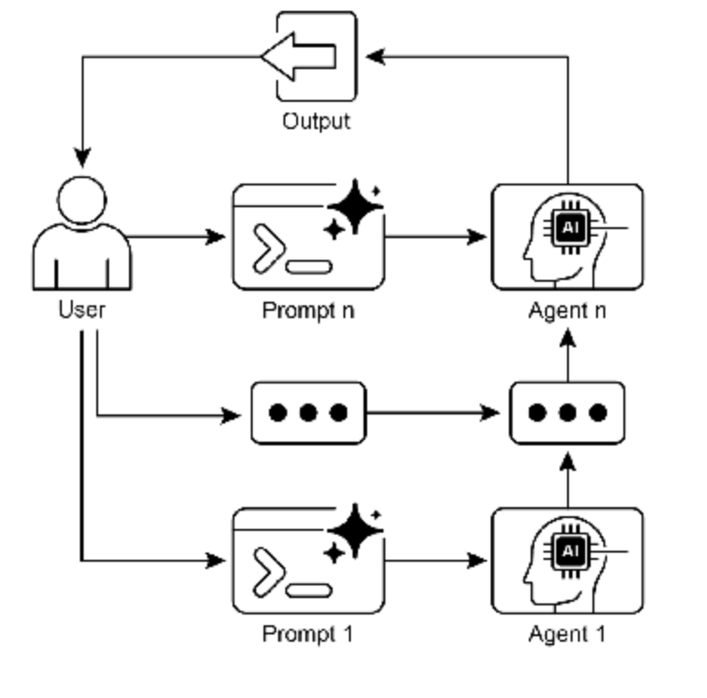
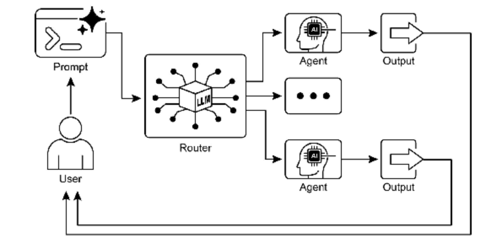

# Chapter 1: Prompt Chaining

## At a Glance

**What:** Complex tasks often overwhelm LLMs when handled within a single prompt, leading to significant performance issues. The cognitive load on the model increases the likelihood of errors such as overlooking instructions, losing context, and generating incorrect information. A monolithic prompt struggles to manage multiple constraints and sequential reasoning steps effectively. This results in unreliable and inaccurate outputs, as the LLM fails to address all facets of the multifaceted request.

**是什么：** 复杂任务在单个提示词内处理时通常会使 LLM 不堪重负，导致严重的性能问题。模型的认知负荷增加了错误的可能性，如忽略指令、失去上下文和生成错误信息。单体提示词难以有效管理多个约束和顺序推理步骤。这导致不可靠和不准确的输出，因为 LLM 未能解决多方面请求的所有方面。

**Why:** Prompt chaining provides a standardized solution by breaking down a complex problem into a sequence of smaller, interconnected sub-tasks. Each step in the chain uses a focused prompt to perform a specific operation, significantly improving reliability and control. The output from one prompt is passed as the input to the next, creating a logical workflow that progressively builds towards the final solution. This modular, divide-and-conquer strategy makes the process more manageable, easier to debug, and allows for the integration of external tools or structured data formats between steps. This pattern is foundational for developing sophisticated, multi-step Agentic systems that can plan, reason, and execute complex workflows.

**为什么：** 提示词链通过将复杂问题分解为一系列较小的、相互关联的子任务来提供标准化解决方案。链中的每一步使用聚焦的提示词执行特定操作，显著提高可靠性和控制力。一个提示词的输出作为下一个提示词的输入传递，创建逐步构建最终解决方案的逻辑工作流。这种模块化的分而治之策略使过程更易于管理、更易于调试，并允许在步骤之间集成外部工具或结构化数据格式。这种模式是开发能够规划、推理和执行复杂工作流的复杂多步智能体系统的基础。

**Rule of thumb:** Use this pattern when a task is too complex for a single prompt, involves multiple distinct processing stages, requires interaction with external tools between steps, or when building Agentic systems that need to perform multi-step reasoning and maintain state.

**经验法则：** 当任务对于单个提示词过于复杂、涉及多个不同的处理阶段、需要在步骤之间与外部工具交互，或者在构建需要执行多步推理并维护状态的智能体系统时，使用此模式。

Visual Summary

Fig. 1-1: Prompt Chaining Pattern: Agents receive a series of prompts from the user, with the output of each agent serving as the input for the next in the chain.

## Key Takesaways

- Prompt Chaining breaks down complex tasks into a sequence of smaller, focused steps. This is occasionally known as the Pipeline pattern.
- Each step in a chain involves an LLM call or processing logic, using the output of the previous step as input.
- This pattern improves the reliability and manageability of complex interactions with language models.
- Frameworks like LangChain/LangGraph, and Google ADK provide robust tools to define, manage, and execute these multi-step sequences.
- 提示词链将复杂任务分解为一系列较小的、聚焦的步骤。这有时也被称为管道模式。
- 链中的每一步都涉及LLM调用或处理逻辑，使用前一步的输出作为输入。
- 这种模式提高了与语言模型进行复杂交互的可靠性和可管理性。
- LangChain/LangGraph和Google ADK等框架提供了定义、管理和执行这些多步序列的健壮工具。

## Conclusion

By deconstructing complex problems into a sequence of simpler, more manageable sub-tasks, prompt chaining provides a robust framework for guiding large language models. This “divide-and-conquer” strategy significantly enhances the reliability and control of the output by focusing the model on one specific operation at a time. As a foundational pattern, it enables the development of sophisticated AI agents capable of multi-step reasoning, tool integration, and state management. Ultimately, mastering prompt chaining is crucial for building robust, context-aware systems that can execute intricate workflows well beyond the capabilities of a single prompt.

通过将复杂问题分解为一系列更简单、更易于管理的子任务，提示词链为指导大型语言模型提供了一个健壮的框架。这种”分而治之”策略通过一次专注于一个特定操作，显著提高了输出的可靠性和控制力。作为基础模式，它支持开发能够进行多步推理、工具集成和状态管理的复杂 AI 智能体系统。最终，掌握提示词链对于构建能够执行远超单个提示词能力的复杂工作流的健壮、上下文感知系统至关重要。

# Chapter 2: Routing

## At a Glance

**What**: Agentic systems must often respond to a wide variety of inputs and situations that cannot be handled by a single, linear process. A simple sequential workflow lacks the ability to make decisions based on context. Without a mechanism to choose the correct tool or sub-process for a specific task, the system remains rigid and non-adaptive. This limitation makes it difficult to build sophisticated applications that can manage the complexity and variability of real-world user requests.

**是什么：** 智能体系统必须经常响应各种各样的输入和情况，这些无法由单一的线性流程处理。简单的顺序工作流缺乏基于上下文做出决策的能力。没有为特定任务选择正确工具或子流程的机制，系统仍然是僵化和非自适应的。这种限制使得难以构建能够管理现实世界用户请求的复杂性和可变性的复杂应用程序。

**Why:** The Routing pattern provides a standardized solution by introducing conditional logic into an agent’s operational framework. It enables the system to first analyze an incoming query to determine its intent or nature. Based on this analysis, the agent dynamically directs the flow of control to the most appropriate specialized tool, function, or sub-agent. This decision can be driven by various methods, including prompting LLMs, applying predefined rules, or using embedding-based semantic similarity. Ultimately, routing transforms a static, predetermined execution path into a flexible and context-aware workflow capable of selecting the best possible action.

**为什么：** 路由模式通过将条件逻辑引入智能体的操作框架提供了标准化解决方案。它使系统能够首先分析传入查询以确定其意图或性质。基于此分析，智能体动态地将控制流定向到最合适的专门工具、函数或子智能体。这个决策可以由各种方法驱动，包括提示 LLM、应用预定义规则或使用基于嵌入的语义相似性。最终，路由将静态的预定执行路径转变为能够选择最佳可能操作的灵活和上下文感知工作流。

**Rule of Thumb:** Use the Routing pattern when an agent must decide between multiple distinct workflows, tools, or sub-agents based on the user’s input or the current state. It is essential for applications that need to triage or classify incoming requests to handle different types of tasks, such as a customer support bot distinguishing between sales inquiries, technical support, and account management questions.

**经验法则：** 当智能体必须根据用户输入或当前状态在多个不同的工作流、工具或子智能体之间做出决策时，使用路由模式。它对于需要对传入请求进行分类以处理不同类型任务的应用程序至关重要，例如客户支持机器人区分销售查询、技术支持和帐户管理问题。

## **Visual Summary:**

​                                          Fig.2-1: Router pattern, using an LLM as a Router

## Key Takeaways

- Routing enables agents to make dynamic decisions about the next step in a workflow based on conditions.
- It allows agents to handle diverse inputs and adapt their behavior, moving beyond linear execution.
- Routing logic can be implemented using LLMs, rule-based systems, or embedding similarity.
- Frameworks like LangGraph and Google ADK provide structured ways to define and manage routing within agent workflows, albeit with different architectural approaches.
- 路由使智能体能够根据条件动态决定工作流中的下一步。
- 它允许智能体处理各种输入并调整其行为，超越线性执行。
- 路由逻辑可以使用 LLM、基于规则的系统或嵌入相似性实现。
- 像 LangGraph 和 Google ADK 这样的框架提供了在智能体工作流中定义和管理路由的结构化方式，尽管采用不同的架构方法。

## Conclusion

The Routing pattern is a critical step in building truly dynamic and responsive agentic systems. By implementing routing, we move beyond simple, linear execution flows and empower our agents to make intelligent decisions about how to process information, respond to user input, and utilize available tools or sub-agents.

路由模式是构建真正动态响应式智能体系统的关键步骤。通过实现路由，我们超越了简单的线性执行流，使智能体能够智能地决策如何处理信息、响应用户输入以及利用可用工具或子智能体。

We’ve seen how routing can be applied in various domains, from customer service chatbots to complex data processing pipelines. The ability to analyze input and conditionally direct the workflow is fundamental to creating agents that can handle the inherent variability of real-world tasks.

我们已经看到路由如何应用于各个领域，从客户服务聊天机器人到复杂的数据处理管道。分析输入并有条件地指导工作流的能力是创建能够处理现实世界任务固有可变性的智能体的基础。

The code examples using LangChain and Google ADK demonstrate two different, yet effective, approaches to implementing routing. LangGraph’s graph-based structure provides a visual and explicit way to define states and transitions, making it ideal for complex, multi-step workflows with intricate routing logic. Google ADK, on the other hand, often focuses on defining distinct capabilities (Tools) and relies on the framework’s ability to route user requests to the appropriate tool handler, which can be simpler for agents with a well-defined set of discrete actions.

使用 LangChain 和 Google ADK 的代码示例展示了实现路由的两种不同但有效的方法。LangGraph 基于图的结构提供了定义状态和转换的可视化和显式方式，使其成为具有复杂路由逻辑的复杂多步工作流的理想选择。另一方面，Google ADK 通常专注于定义不同的能力（工具）并依赖框架将用户请求路由到适当的工具处理程序的能力，这对于具有明确定义的离散操作集的智能体来说可能更简单。

Mastering the Routing pattern is essential for building agents that can intelligently navigate different scenarios and provide tailored responses or actions based on context. It’s a key component in creating versatile and robust agentic applications.

掌握路由模式对于构建能够智能地导航不同场景并根据上下文提供定制响应或操作的智能体至关重要。它是创建多功能和健壮智能体应用程序的关键组件。
